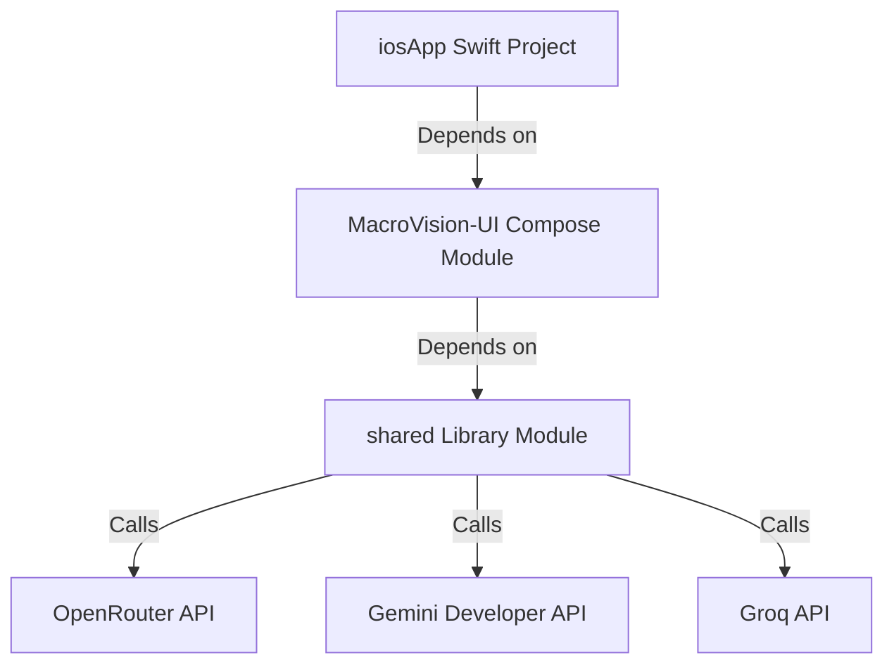

# 📸 MacroVision — AI Food Nutrition Tracker

MacroVision is a modern, cross-platform **Kotlin Multiplatform (KMP)** application designed to simplify meal tracking. Capture a photo of your food, and MacroVision will automatically estimate its ingredients, weights, and macronutrient profile using a robust, multi-provider Vision-Language Model (VLM) failover sequence.

---

## ✨ Features

* **📷 Camera Capture & Optimization**: Captures meal photos and optimizes them (resizing and compression) on-device before transmission to minimize token utilization and network latency.
* **⚡ Robust VLM Failover Pipeline**: Sequences API calls across multiple providers (OpenRouter ➜ Google Gemini ➜ Groq) to guarantee uptime and resilience against service outages.
* **✏️ Interactive Corrections & Recalculation**: If the VLM misidentifies an ingredient or portion, you can edit it directly on-screen. Tapping recalculate triggers a lightweight, text-only prompt to update macros instantly (~10x faster than re-uploading the image).
* **📱 Compose Multiplatform UI**: Shared declarative UI for Android and iOS using Jetpack Compose/Compose Multiplatform, featuring custom water logging widgets and premium glassmorphism layouts.
* **🛡️ Secure Configurations**: Compile-time build configuration bindings that prevent credentials from leaking to public repositories.

---

## 🏗️ Architecture Diagram



---

## 📂 Project Structure

* **`:shared`**: Platform-independent Kotlin library hosting HTTP clients, data models (e.g. `NutritionResponse`), and LLM/VLM logic.
* **`:MacroVision-UI`**: Shared UI application containing Compose screens, Jetpack Navigation, platform-specific Camera implementations, and persistent preferences.
* **`iosApp/`**: Native Xcode project wrapping and launching the Compose app framework on iOS devices.

---

## 🛠️ Setup & Configuration

To run the application, you need to configure your API keys.

1. Create a `.env` file in the root directory:
   ```env
   OPENROUTER_API_KEY=your_openrouter_api_key_here
   GEMINI_API_KEY=your_gemini_api_key_here
   GROQ_API_KEY=your_groq_api_key_here
   ```

2. **Android Setup**: Gradle automatically loads these variables at build-time and exposes them via `BuildConfig`.
3. **iOS Setup**: Run the build script or build in Xcode. Xcode executes `iosApp/sync_env.ps1` to sync `.env` values into `Config.xcconfig` and expose them to `Info.plist`.

---

## 🚀 Build & Run

### Android
Compile and install the debug app on a connected device/emulator:
```bash
./gradlew :MacroVision-UI:installDebug
```

### iOS
1. Open `iosApp/iosApp.xcodeproj` in Xcode.
2. Select your target device/simulator.
3. Press **Cmd + R** to build and run.

---

## 📊 Competitor Research
A detailed study of the AI food tracking space (analyzing features of MyFitnessPal, Lose It!, Cronometer, Yazio, Foodvisor, and Lifesum) has been compiled to guide the roadmap. Read the full analysis at [competitor_analysis_detailed.md](competitor_analysis_detailed.md).
