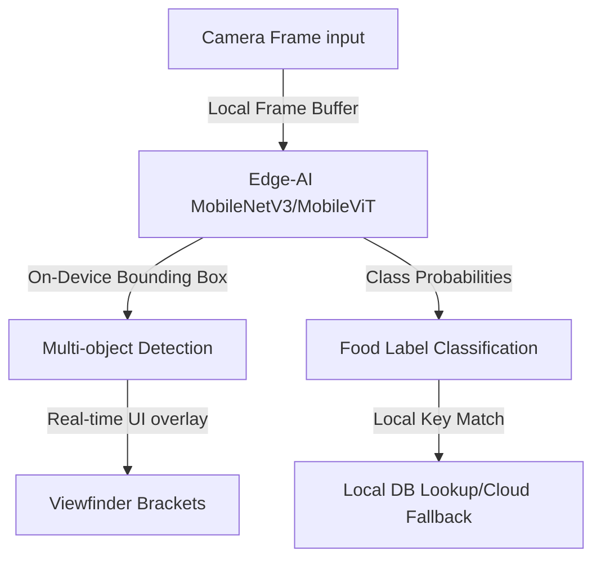

# Deep Field Study: AI Food Recognition & Calorie Estimation Competitor Landscape

This document conducts a technical analysis of the major players in the AI-powered dietary logging space. It analyzes their machine learning pipelines, portion estimation systems, dataset moats, and deployment models to contextualize the development of **MacroVision**.

---

## Executive Summary

The AI food tracking landscape is undergoing a paradigm shift. Traditional market leaders (e.g., MyFitnessPal, Lose It!) are transitioning from manual catalog searches to automatic vision-based tracking. 

The industry is currently divided into two core architectural approaches:
1. **Classical Segment-Classify-Lookup Pipelines**: Relying on separate edge/cloud models for item segmentations, CNN-based classifications, and SQL-like database lookups (e.g., Foodvisor, Passio.ai).
2. **Modern Multi-Modal Vision-Language Models (VLMs)**: Re-imagining nutrition tracking as an end-to-end semantic reasoning problem, predicting ingredients, cooking styles, weights, and hidden fats directly from visual inputs (e.g., MacroVision's use of Qwen2.5-VL, SnapCalorie's hybrid VLM reasoning).

---

## Competitor Matrix

| Competitor / Platform | Primary ML Engine | Model Deployment | Portion / Volume Estimation | Latency | Key Strengths / Moats |
| :--- | :--- | :--- | :--- | :--- | :--- |
| **SnapCalorie** | Custom 3D Vision Regression + Depth Estimators | Hybrid (On-device sensor + Cloud VLM) | **LiDear Depth Sensing** + 3D Volumetric Calculations | ~2–4s | **Nutrition5k** dataset; LiDAR integration; outperforms human nutritionists. |
| **MyFitnessPal** (powered by *Passio.ai*) | On-Device MobileNetV3 / MobileViT | **100% Edge AI** (Runs locally on Apple Neural Engine / Android NPU) | 2D Bounding Box scaling | **<100ms** (Real-time overlay) | Ultra-low latency; works offline; private; runs on edge. |
| **Foodvisor** | Multi-Task CNN (Classification + Mask R-CNN) | Cloud API | Geometric projection (3D volume from 2D coordinates) | ~1.5–3s | Strong European database localization (CIQUAL); high-quality user UI. |
| **Lose It!** (Snap It) | Standard CNN classifier + LLM-based parsing | Cloud API | Manual confirmation + 2D area scaling | ~10–12s | Massive historical user base; simple single-ingredient accuracy. |
| **Bite AI** (Bitesnap API) | Hierarchical Vision Models + Contextual Ranking | Cloud API | User-corrected bounding boxes | ~1–2s | Food Knowledge Graph; temporal context (time of day, history) ranking. |
| **MacroVision** (Our App) | **Qwen2.5-VL-72B-Instruct** (Vision-Language Model) | Cloud API (OpenRouter) | Zero-Shot VLM Semantic Reasoning + Interactive Weight Pills | ~2–3s | Zero-config setup; deep semantic understanding (hidden fats, dressings); multi-item flexibility. |

---

## Deep-Dive: Core Technologies & Model Architectures

### 1. SnapCalorie: Volumetric LiDAR + Nutrition5k
*   **The Problem:** Traditional 2D images lack depth information. A large portion of lettuce can look identical to a small, compressed portion, leading to huge calorie estimation errors.
*   **The Architecture:** SnapCalorie utilizes a hybrid depth-estimation pipeline. On iOS devices equipped with LiDAR sensors, the app captures a point cloud to calculate the exact physical **volume** of the food ($V = \text{height} \times \text{area}$).
*   **The Model:** They train 3D Convolutional Neural Networks and Regression Models that map these volumes to caloric densities.
*   **The Dataset Moat:** To train this, the founders built the **Nutrition5k** dataset. It consists of 5,000 real-world dishes. Every single ingredient was weighed on precision scales before and after cooking, and then photographed from 360-degree angles. This dataset allows their models to learn occlusion ratios (e.g., how much rice is typically hidden beneath a piece of salmon).

### 2. Passio.ai (MyFitnessPal): Edge-AI Optimization
*   **The Problem:** Sending high-resolution images to cloud servers is slow, expensive, and raises privacy concerns.
*   **The Architecture:** Passio.ai designs custom neural architectures optimized for on-device mobile hardware (using Apple CoreML and Android NNAPI).
*   **The Model:** They deploy heavily optimized, pruned **MobileViT (Mobile Vision Transformers)** and **MobileNetV3** backbones. By utilizing Quantization (converting weights from 32-bit floats to 8-bit integers), they fit complex multi-class models (recognizing 2,000+ distinct foods) directly into less than 50MB of phone memory.
*   **The Pipeline:** When a user opens the camera, the model runs local frame-by-frame inference. It uses bounding boxes to track foods in real-time, providing immediate visual bounding overlays without network roundtrips.



### 3. Foodvisor: Geometric 3D Segmentation
*   **The Architecture:** Uses a **Mask R-CNN** architecture to perform instance segmentation. The model isolates the exact contour of each food item on the plate rather than just drawing a square box.
*   **Portion Estimation:** By identifying the shape of the plate (often using a standard circular plate as a size reference) and calculating the pixel area of the food relative to the plate, the algorithm projects a 3D geometric shape (e.g., cylinder for a glass, hemisphere for a scoop of rice) to estimate weight.

### 4. Bite AI: Hierarchical Contextual Intelligence
*   **The Architecture:** Uses hierarchical classification. A traditional classifier might fail if it has to choose between 10,000 distinct items. Bite AI's model first classifies the super-category (e.g., "soup"), then narrows down to sub-categories (e.g., "vegetable soup"), and finally estimates ingredients.
*   **Contextual Prioritization:** The model weights its output using a **Bayesian Prior**. If the user is eating at 8:00 AM, the probability of "scrambled eggs" is boosted, while at 8:00 PM "salmon fillet" is favored. It also learns individual user behavior over time.

---

## Contrasting Paradigms: Traditional CV vs. Modern VLMs

MacroVision's use of **OpenRouter's Qwen2.5-VL-72B-Instruct** bypasses the traditional multi-stage pipeline (detection -> segmentation -> database lookup -> heuristic portion scaling) in favor of **End-to-End VLM Reasoning**.

```
TRADITIONAL PIPELINE:
[Image] -> [Object Detector] -> [CNN Classifier] -> [Heuristic Area Metric] -> [Nutritional Database Lookup] -> [Manual Adjust]

VLM PARADIGM:
[Image + System Prompt] ---------------------> [VLM End-to-End Model] ---------------------> [JSON Output + Structured Rationale]
```

### Visual-Language Model (VLM) Advantages
1.  **Semantic Inference of Occluded Ingredients:** A standard CNN only classifies visible pixels. A VLM understands the context of a "Salmon Bowl" and reasons that there is likely olive oil, salt, or dressing coating the asparagus and quinoa, calculating these hidden calories.
2.  **Recipe Reconstruction:** VLMs can deduce the preparation style (e.g., "deep-fried" vs. "air-fried") based on subtle textures and sheen, adjusting macronutrient calculations accordingly.
3.  **Zero-Shot Robustness:** Instead of needing to retrain a classification model for every new food trend (e.g., açai bowls, matchas), the VLM leverages its pre-trained visual-semantic knowledge to accurately log novel items instantly.

### Technical Challenges of the VLM Approach
*   **Latency:** VLM API requests take 1–3 seconds, whereas edge-AI classification takes <50ms.
*   **Spatial Blindness:** VLMs sometimes struggle with exact scale and depth without reference objects. This is why MacroVision's **interactive weight pills** are an essential UX bridge: the AI estimates the relative proportions, but the user can easily fine-tune the absolute weights.

---

## Key Takeaways for MacroVision's Roadmap

To maintain a competitive edge, MacroVision should capitalize on the following design decisions:

1.  **Refine the VLM Prompting Heuristics**: Our system prompt must instruct the VLM to explicitly look for **hidden ingredients** (fats, oils, dressings) and reference standard portion sizes (e.g., "a deck of cards size for steak represents ~100g") to mitigate spatial estimation issues.
2.  **Edge-Cloud Hybridization**: In future versions, we can implement a lightweight on-device classifier (like MobileNet) to give immediate visual feedback in the viewfinder (Passio-style), while delegating the deep nutritional reasoning and ingredient breakdown to the cloud VLM on capture.
3.  **Capitalize on the US-Database standard (USDA)**: Ensure our VLM output structure encourages mapping ingredients back to standard USDA FoodData Central IDs for maximum medical and scientific credibility.
